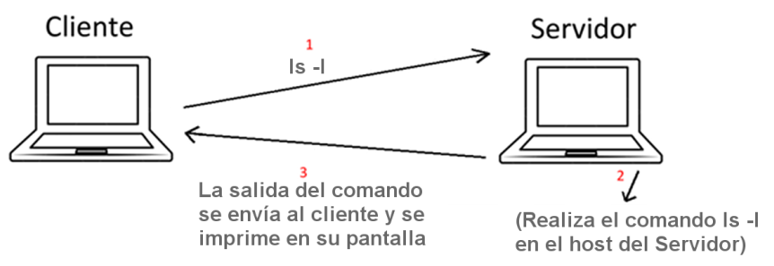
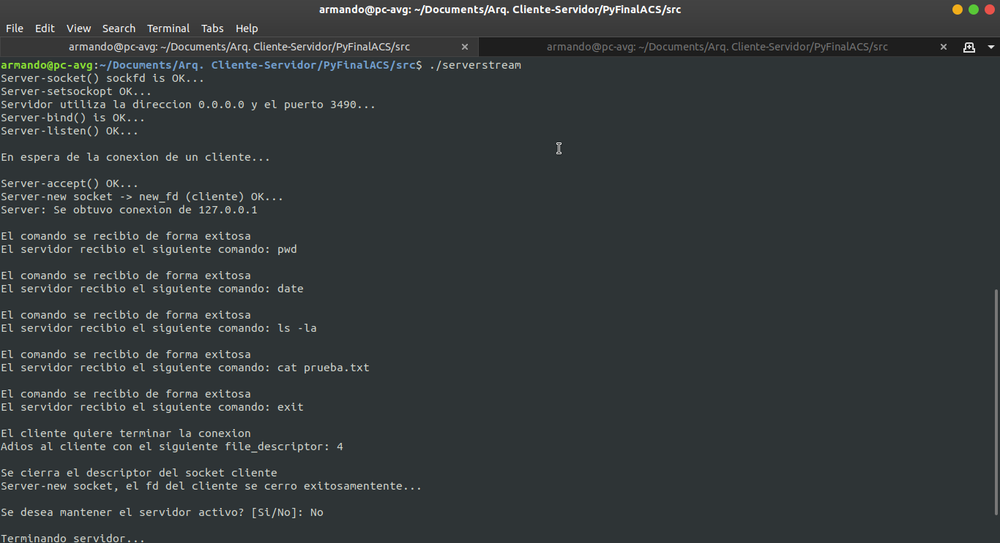
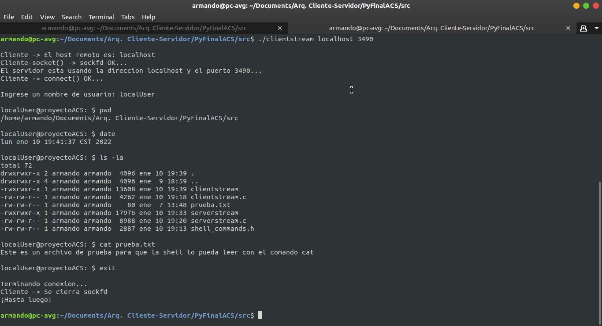

# Proyecto Final Arquitectura Cliente-Servidor

## Descripción
En este proyecto se encuentra una implementación de un modelo Cliente-Servidor donde se ejecutan comandos (de forma remota) ingresados por el cliente, como ocurre con el protocolo SSH.



## Ejecución
Para ejecutarlo, de manera **local**, nos ubicamos dentro de la carpeta `src` y realizamos lo siguiente:

1. Se compila el archivo `serverstream.c`.
    ```console
        gcc clientstream.c -o serverstream
    ```
2. Se compila el archivo `clientstream.c`.
    ```console
        gcc clientstream.c -o clientstream
    ```
3. Ejecutamos el programa `serverstream`.
    ```console
        ./serverstream
    ```
4. Por último, ejecutamos el programa `clientstream` con los argumentos `localhost` y `3490` (que son la dirección IP y el puerto del servidor, respectivamente).
    ```console
        ./clientstream localhost 3490
    ```
Para finalizar la conexión del lado del cliente, ingresamos el comando `exit`.

Cuando se finalice la conexión con el cliente, del lado del servidor se preguntará si se desea que éste se mantenga activo o no.

## Resultados
* Del lado del servidor:



* Del lado del cliente: 


